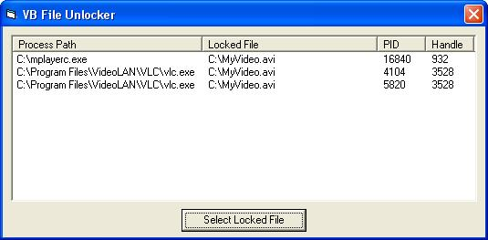



## Unlock locked files

### Description

This code allows you to close the process(es) that keep a file locked, by simply specifying the locked file. This is similar to what Unlocker, ForceDel, WhoLockMe and UnlockIt do. I'm not taking credit for this code, because I downloaded it myself from a Chinese site and only removed the unnecessary code and created the sample project. All credits go to the original author. Have fun with it.
 
### More Info
 

             |
---                |---
**Submitted On**   |2007-12-24 05:42:54
**By**             |[Chris Donovan](https://github.com/Planet-Source-Code/PSCIndex/blob/master/ByAuthor/chris-donovan.md)
**Level**          |Advanced
**User Rating**    |5.0 (15 globes from 3 users)
**Compatibility**  |VB 6\.0
**Category**       |[Files/ File Controls/ Input/ Output](https://github.com/Planet-Source-Code/PSCIndex/blob/master/ByCategory/files-file-controls-input-output__1-3.md)
**World**          |[Visual Basic](https://github.com/Planet-Source-Code/PSCIndex/blob/master/ByWorld/visual-basic.md)
**Archive File**   |[Unlock\_loc20948112232007\.zip](https://github.com/Planet-Source-Code/chris-donovan-unlock-locked-files__1-69799/archive/master.zip)

